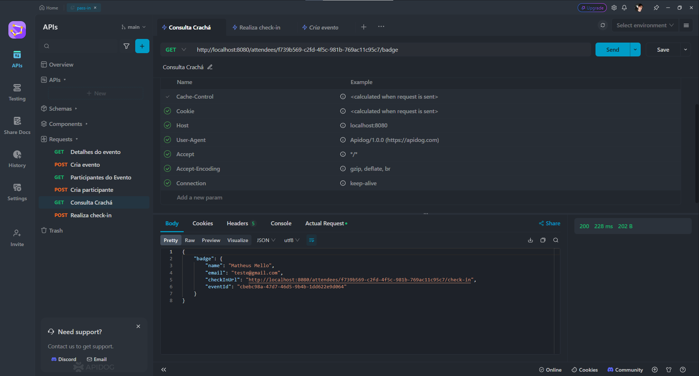

# Pass In Service

Aplicação de gestão de participantes em eventos presenciais.

- A ferramenta permite que o organizador cadastre um evento e abra uma página pública de inscrição.
- Os participantes inscritos podem emitir uma credencial para check-in no dia do evento.
- O sistema fará um scan da credencial do participante para permitir a entrada no evento.

# Configurações

**Clone o projeto e acesse a pasta**

```bash
git clone git@github.com:matheusgmello/pass-in.git && cd pass-in
```

- Configure as variáveis de ambiente no arquivo `application.properties`.
- Rode a aplicação (`./mvnw spring-boot:run`)
- Teste a aplicação no Rest Client da sua preferência

# Tecnologias 

- [Java](https://www.oracle.com/java/technologies/javase/jdk17-archive-downloads.html)
- [Spring](https://spring.io/projects/spring-boot)
- [Flyway](https://flywaydb.org/)
- [Hsqldb](https://hsqldb.org/)
- [Loombok](https://jdk.java.net/loom/)


## 🔗 Connect with me
[](https://linkedin.com/in/matheusgmello)
[](https://www.reddit.com/user/math7zw)
[](https://github.com/matheusgmello/)


